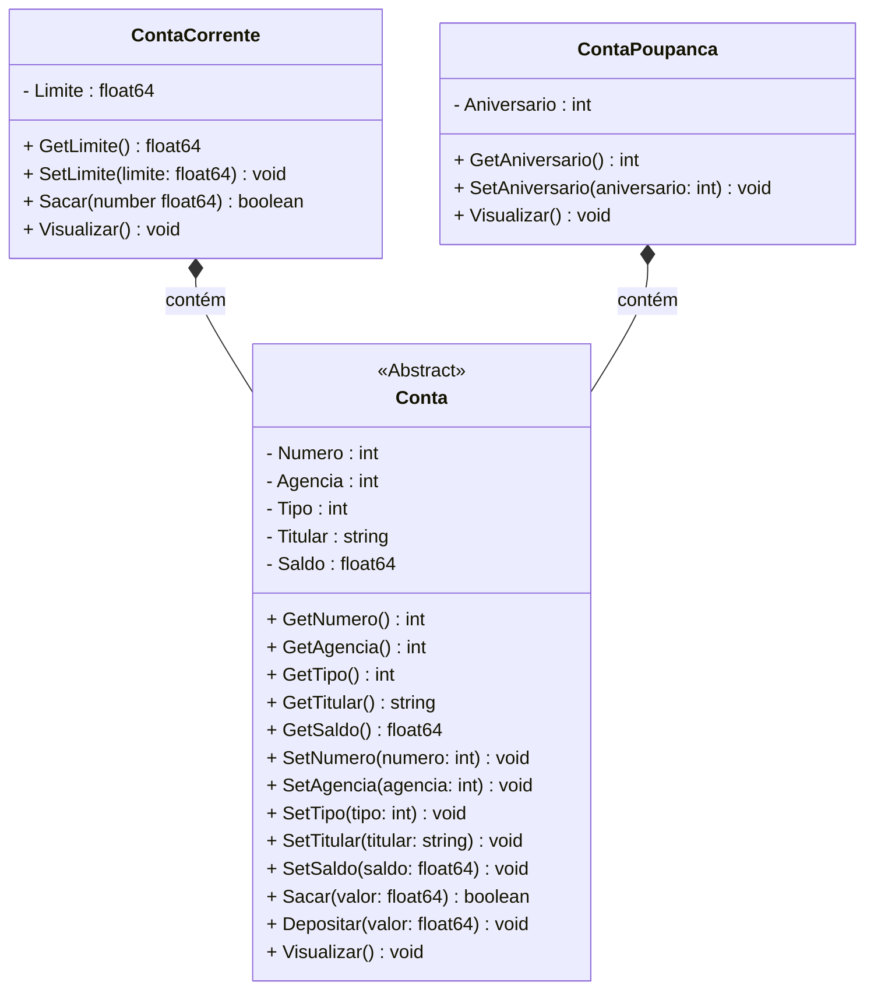
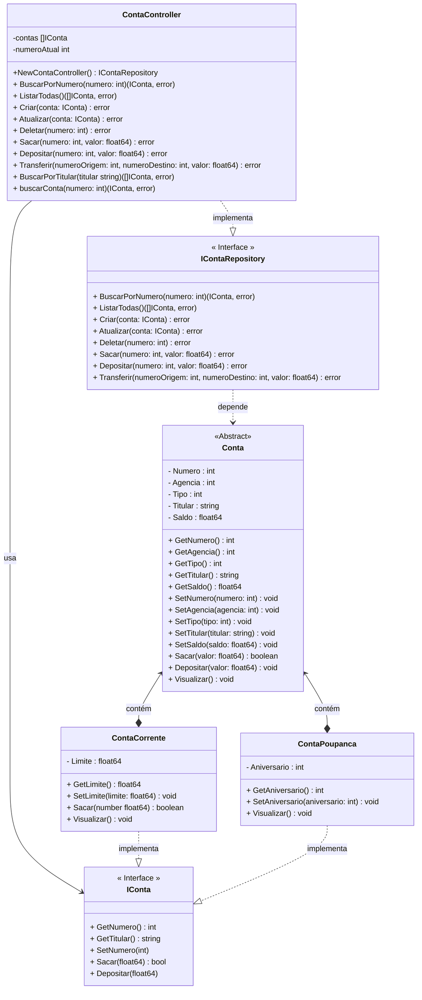

# Projeto Conta Bancária - Golang

<br />

<div align="center">
     
     
</div>
<br /><br />

Este projeto implementa um sistema básico de gerenciamento de contas bancárias utilizando a linguagem Go, utilizando os conceitos da Programação Orientada a Objetos oferecidos pela Linguagem. O sistema oferece funcionalidades para criar, gerenciar e realizar operações bancárias básicas em diferentes tipos de contas bancárias.

<br />

## Principais Características

1. **Gerenciamento de Contas**: 
   - Criação de diferentes tipos de contas (Conta Corrente e Conta Poupança)
   - Listagem de todas as contas
   - Busca de conta por número
   - Atualização e remoção de contas

2. **Operações Bancárias**: 
   - Saque
   - Depósito
   - Transferência entre contas

3. **Polimorfismo**: 
   - Utilização de interface `IConta` para permitir operações uniformes em diferentes tipos de contas, simulando o Polimorfismo em Golang

4. **Controle de Números de Conta**: 
   - Geração automática de números de conta, simulando a Chave Primária de um banco de dados

## Estrutura do Projeto

O projeto é estruturado em diferentes componentes:

1. **Controller (ContaController)**:
   - Implementa a lógica de negócios
   - Gerencia uma coleção de contas
   - Implementa a interface `IContaRepository`

2. **Interfaces**:
   - `IConta`: Define os métodos básicos que todos os tipos de conta devem implementar
   - `IContaRepository`: Define as operações de CRUD e as transações bancárias

3. **Modelos de Conta**:
   - Implementação do Modelo de dados da aplicação (`Conta`, `ContaCorrente` e `ContaPoupanca`)
   - Implementações concretas da Interface `IConta` 

## Tecnologias

- **Linguagem**: Go
- **Princípios de Design**: 
  - Programação Orientada a Objetos
  - Relacionamento entre Classes do tipo Associação por Composição
  - Inversão de Dependência (Injeção de Dependências)
  - Simulação de Polimorfismo através de Interfaces

## Funcionalidades Detalhadas

- Criação de contas com número único gerado automaticamente
- Listagem de todas as contas cadastradas
- Busca de conta específica por número
- Atualização de informações de conta
- Remoção de contas do sistema
- Operações de saque com verificação de saldo
- Depósitos em contas
- Transferências entre contas com validação

<br /><br />

## Diagramas de Classe

### Diagrama 01 - Classes Model



<br />

### Diagrama 02 - Diagrama Completo




<br /><br />

## Print da Tela

<div align="center">
   
</div>

<br /><br />

## Bibliotecas

- **Color** (https://github.com/fatih/color)
- **Survey** (https://github.com/AlecAivazis/survey/)

<br /><br />

## Executar o Projeto


Para executar um projeto em Go, siga estes passos básicos:

1. Instale o Go na sua máquina, caso ele ainda não esteja instalado (https://go.dev/)

2. Clone o projeto na sua máquina

3. Abra o projeto no Visual Studio Code

4. Abra o Terminal do Visual Studio Code

5. Instale todas as Dependências do projeto, através do comando abaixo:

```bash
go mod tidy
```

6. As dependências serão registradas automaticamente no seu arquivo `go.mod`.

7. Execute o Projeto, via terminal, através do comando abaixo:


```bash
go run main.go
```

8. Para compilar o seu projeto em um arquivo executável (exe), use o comando abaixo:

```bash
go build main.go
```

9. O comando acima gerará um arquivo executável chamado **main.exe**. 
10. Você pode executar o arquivo gerado através do comando abaixo:

```bash
./main.exe  # Para Unix/Linux/Mac
main.exe  # Para Windows
```

