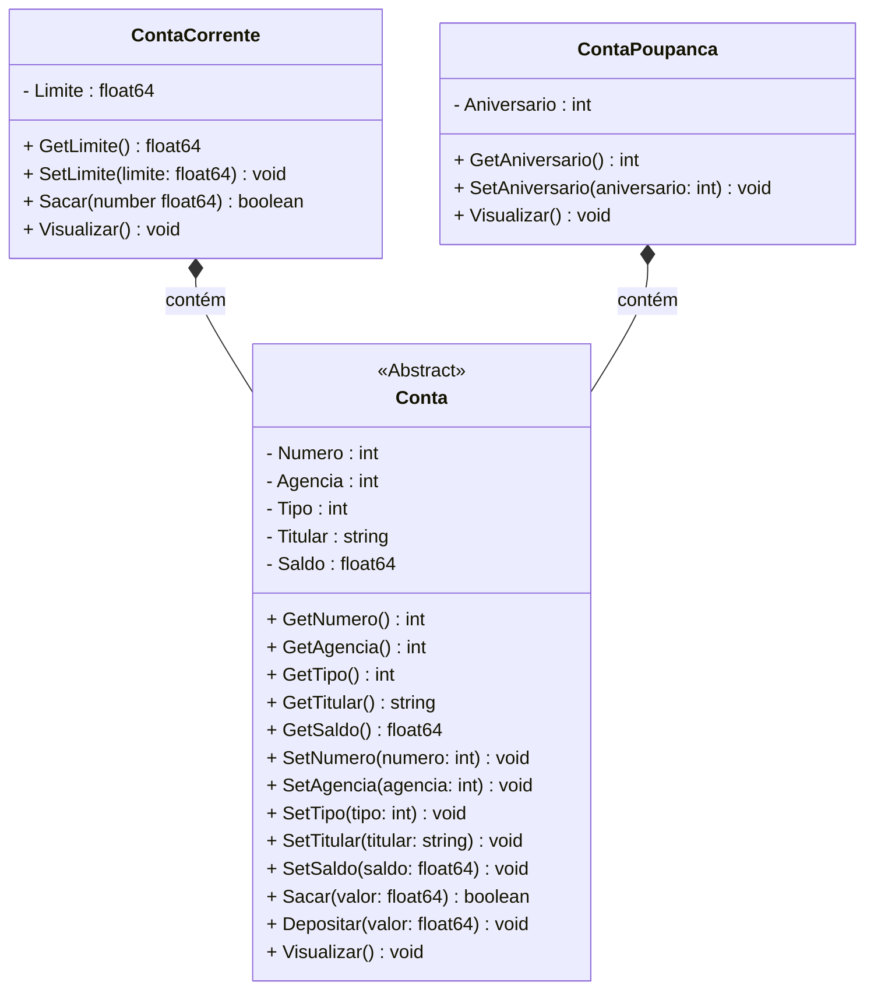
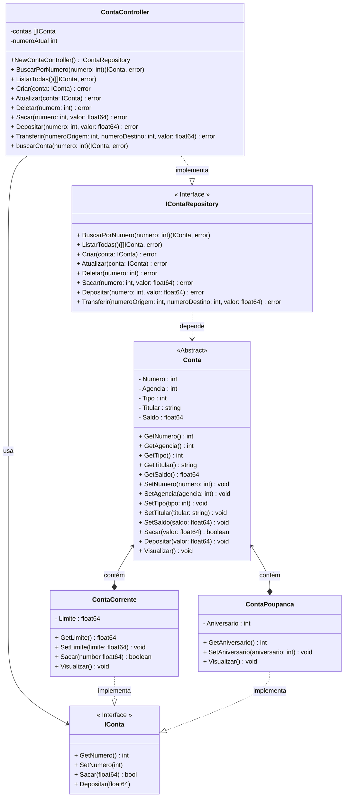

# Projeto Conta Bancária - Golang

 

     
     

  

## Diagramas de Classe

### Diagrama 01 - Classes Model

 

### Diagrama 02 - Diagrama Completo

  

## Print da Tela

   

  

## Bibliotecas

- **Color** (https://github.com/fatih/color)
- **Survey** (https://github.com/AlecAivazis/survey/)

